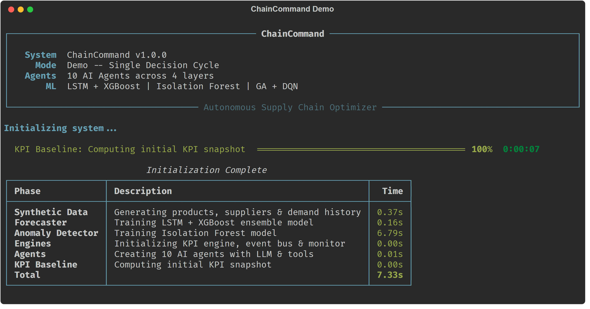
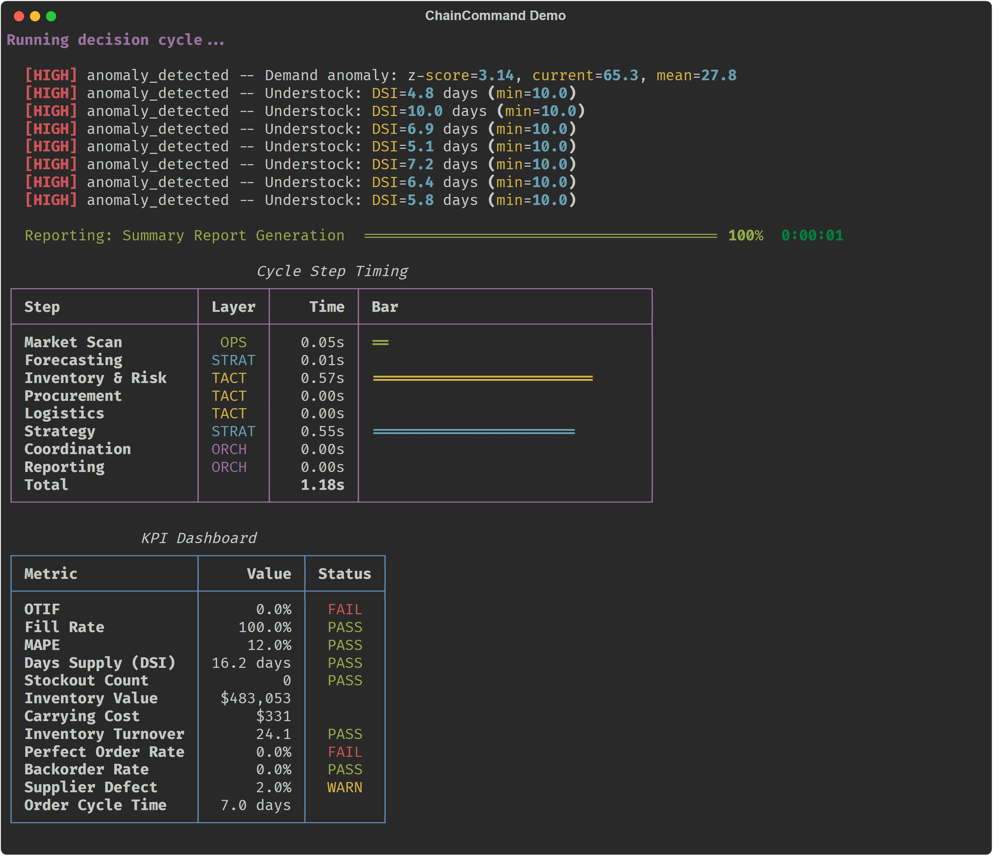
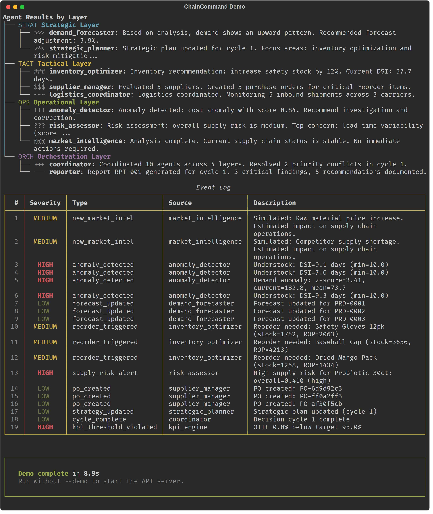

<div align="center">

# ChainCommand — Autonomous Supply Chain Optimizer Agent Team

**10 AI Agents × 3 Temporal Layers × Event-Driven Architecture: From Data to Autonomous Decisions**

[](https://www.python.org/downloads/)
[](https://fastapi.tiangolo.com/)
[](https://docs.pydantic.dev/)
[](LICENSE)
[](#llm-backends)

<br>


</div>

---

## Table of Contents

- [Project Overview](#project-overview)
- [Key Features](#key-features)
- [System Architecture](#system-architecture)
- [Project Structure](#project-structure)
- [Agent Team](#agent-team)
- [Getting Started](#getting-started)
- [Pipeline Details](#pipeline-details)
  - [Phase 1: LLM Abstraction Layer](#phase-1-llm-abstraction-layer)
  - [Phase 2: Agent Tools](#phase-2-agent-tools)
  - [Phase 3: ML Models](#phase-3-ml-models)
  - [Phase 4: KPI Engine](#phase-4-kpi-engine)
  - [Phase 5: Event Engine](#phase-5-event-engine)
  - [Phase 6: Agent Team](#phase-6-agent-team)
  - [Phase 7: API Layer](#phase-7-api-layer)
  - [Phase 8: Orchestrator](#phase-8-orchestrator)
- [API Reference](#api-reference)
- [Decision Cycle Walkthrough](#decision-cycle-walkthrough)
- [Research Foundations](#research-foundations)
- [Roadmap & Future Work](#roadmap--future-work)
- [Tech Stack](#tech-stack)
- [Contributing](#contributing)
- [License](#license)
- [Acknowledgments](#acknowledgments)

---

## Project Overview

**ChainCommand** is a multi-agent AI system that autonomously optimizes supply chain operations. Ten specialized agents — organized across strategic, tactical, and operational layers — collaborate through an event-driven architecture to forecast demand, manage inventory, assess risk, coordinate logistics, and produce executive reports.

The system runs fully autonomously in mock mode (no API keys needed), generating synthetic data, training ML models, and executing complete decision cycles where agents communicate via pub/sub events, escalate high-cost actions to human approval, and continuously optimize KPIs.

### Why This Project?

| Challenge | Our Approach |
|-----------|-------------|
| Supply chain decisions are siloed | 10 specialized agents with cross-layer event communication |
| Forecasting relies on single models | LSTM + XGBoost ensemble with dynamic MAPE-based weighting |
| Inventory optimization is static | GA global search + DQN reinforcement learning hybrid |
| High-cost decisions lack oversight | HITL (Human-In-The-Loop) gates with configurable thresholds |
| Bullwhip effect amplifies volatility | Beer game consensus mechanism across agent layers |
| Monitoring is reactive | Proactive monitor scans every tick for anomalies and KPI violations |

---

## Key Features

- **10-Agent Autonomous Team** — Demand Forecaster, Strategic Planner, Inventory Optimizer, Supplier Manager, Logistics Coordinator, Anomaly Detector, Risk Assessor, Market Intelligence, Coordinator (CSCO), and Reporter
- **3-Layer Temporal Architecture** — Strategic (weekly/monthly), Tactical (daily), and Operational (real-time) decision layers inspired by JD.com's two-tier architecture (ArXiv 2509.03811)
- **Event-Driven Communication** — Pub/sub EventBus decouples agent interactions; agents subscribe to relevant events and react autonomously
- **Ensemble Forecasting** — LSTM + XGBoost with dynamic inverse-MAPE weighting that auto-adjusts based on per-model accuracy
- **Hybrid Optimization** — Genetic Algorithm for global parameter search + DQN reinforcement learning for dynamic inventory decisions
- **Anomaly Detection** — Isolation Forest + Z-score detection for demand spikes, cost anomalies, and lead-time deviations
- **HITL Approval Gates** — Orders >$50K require human approval; <$10K auto-approved; configurable via environment variables
- **Proactive Monitoring** — Continuous tick-based scanning for low stock, KPI violations, delivery delays, and anomalies
- **12 KPI Metrics** — OTIF, fill rate, MAPE, DSI, stockout count, inventory turnover, carrying cost, perfect order rate, backorder rate, supplier defect rate, and more
- **REST API + WebSocket** — Full FastAPI dashboard with live event streaming, agent triggers, and simulation control
- **Rich Terminal UI** — Demo mode with animated progress bars, color-coded KPI dashboard, agent layer tree, event log with severity highlighting, and step timing charts (powered by `rich`)
- **Mock-First Design** — Complete system runs without any API keys using rule-based mock LLM

---

## System Architecture

### Diagram 1 — System Architecture Overview


### Diagram 2 — 10-Agent 8-Step Decision Cycle


### Diagram 3 — Event-Driven Sequence Diagram


### Diagram 4 — ML Pipeline


### Diagram 5 — KPI Monitoring Loop


### Diagram 6 — HITL Human-in-the-Loop Approval Flow


### Diagram 7 — API Endpoint Overview


### Diagram 8 — Tech Stack


---

## Project Structure

```
chaincommand/
│
├── __init__.py                          # Package metadata (v1.0.0)
├── __main__.py                          # CLI entry point (--demo / server)
├── config.py                            # Pydantic Settings (env-driven)
├── orchestrator.py                      # System coordinator & runtime state
│
├── llm/                                 # LLM Abstraction Layer
│   ├── __init__.py
│   ├── base.py                          # Abstract base class (generate / generate_json)
│   ├── mock_llm.py                      # Rule-based mock (regex intent matching)
│   ├── openai_llm.py                    # OpenAI async client (JSON mode)
│   ├── ollama_llm.py                    # Ollama local model (httpx)
│   └── factory.py                       # Factory: create_llm() based on CC_LLM_MODE
│
├── data/                                # Domain Data
│   ├── __init__.py
│   ├── schemas.py                       # 13 Pydantic models + 4 enums (Product, Supplier, PO, KPI, etc.)
│   └── generator.py                     # Synthetic data: 50 products, 20 suppliers, 365-day demand
│
├── tools/                               # Agent Tools (16 tools)
│   ├── __init__.py
│   ├── base_tool.py                     # Abstract BaseTool
│   ├── data_tools.py                    # QueryDemandHistory, QueryInventoryStatus, etc.
│   ├── forecast_tools.py               # RunDemandForecast, GetForecastAccuracy
│   ├── optimization_tools.py           # CalculateReorderPoint, OptimizeInventory, EvaluateSupplier
│   ├── risk_tools.py                    # DetectAnomalies, AssessSupplyRisk, ScanMarketIntelligence
│   └── action_tools.py                 # CreatePurchaseOrder, RequestHumanApproval, AdjustSafetyStock, EmitEvent
│
├── models/                              # ML Models
│   ├── __init__.py
│   ├── forecaster.py                    # LSTMForecaster, XGBForecaster, EnsembleForecaster
│   ├── anomaly_detector.py             # AnomalyDetector (Isolation Forest + Z-score)
│   └── optimizer.py                     # GeneticOptimizer, DQNOptimizer, HybridOptimizer
│
├── kpi/                                 # KPI Engine
│   ├── __init__.py
│   └── engine.py                        # KPIEngine (12 metrics, threshold checks, trends)
│
├── events/                              # Event Engine
│   ├── __init__.py
│   ├── bus.py                           # EventBus (async pub/sub)
│   └── monitor.py                       # ProactiveMonitor (tick-based health checks)
│
├── agents/                              # Agent Team (10 agents)
│   ├── __init__.py
│   ├── base_agent.py                    # BaseAgent (think / act / handle_event)
│   ├── demand_forecaster.py             # Strategic: demand analysis & forecasting
│   ├── strategic_planner.py             # Strategic: inventory policy & consensus
│   ├── inventory_optimizer.py           # Tactical: reorder points & safety stock
│   ├── supplier_manager.py              # Tactical: supplier evaluation & procurement
│   ├── logistics_coordinator.py         # Tactical: order tracking & delivery
│   ├── anomaly_detector_agent.py        # Operational: real-time anomaly detection
│   ├── risk_assessor.py                 # Operational: supply risk quantification
│   ├── market_intelligence.py           # Operational: market signal scanning
│   ├── coordinator.py                   # Orchestration: CSCO conflict resolution
│   └── reporter.py                      # Orchestration: structured report generation
│
├── api/                                 # FastAPI Application
│   ├── __init__.py
│   ├── app.py                           # FastAPI app with CORS & lifespan
│   └── routes/
│       ├── __init__.py
│       ├── dashboard.py                 # KPI, inventory, agents, events, forecast, approvals, WebSocket
│       └── control.py                   # Simulation start/stop/speed, agent triggers
│
├── ui/                                  # Rich Terminal UI (demo mode)
│   ├── __init__.py
│   ├── theme.py                        # Visual constants, colors, layer badges
│   └── console.py                      # ChainCommandUI (progress bars, KPI dashboard, trees)
│
└── utils/                               # Utilities
    ├── __init__.py
    └── logging_config.py               # Structlog configuration

tests/                                       # Test suite (skeleton)
├── __init__.py
├── test_agents/
├── test_api/
├── test_integration/
├── test_kpi/
└── test_models/
```

---

## Agent Team

### 10 Agents Across 4 Layers

| Layer | Agent | Role | Tools | Event Subscriptions |
|-------|-------|------|-------|-------------------|
| **Strategic** | Demand Forecaster | Analyze sales patterns, produce demand forecasts | QueryDemandHistory, RunDemandForecast, GetForecastAccuracy, ScanMarketIntelligence | `kpi_threshold_violated`, `new_market_intel` |
| **Strategic** | Strategic Planner | Develop inventory policies, reduce bullwhip effect | QueryKPIHistory, OptimizeInventory, QueryInventoryStatus | `forecast_updated`, `kpi_trend_alert` |
| **Tactical** | Inventory Optimizer | Monitor stock levels, manage reorder points | QueryInventoryStatus, CalculateReorderPoint, AdjustSafetyStock, OptimizeInventory | `low_stock_alert`, `overstock_alert`, `stockout_alert`, `forecast_updated` |
| **Tactical** | Supplier Manager | Evaluate & select suppliers, manage procurement | QuerySupplierInfo, EvaluateSupplier, CreatePurchaseOrder, RequestHumanApproval | `reorder_triggered`, `supplier_issue`, `quality_alert` |
| **Tactical** | Logistics Coordinator | Track shipments, manage delivery timelines | QueryInventoryStatus, EmitEvent | `po_created`, `delivery_delayed` |
| **Operational** | Anomaly Detector | Real-time anomaly detection (demand/cost/quality) | DetectAnomalies, QueryDemandHistory, QueryInventoryStatus | `new_data_point`, `tick` |
| **Operational** | Risk Assessor | Quantify supply risk (depth/breadth/criticality) | AssessSupplyRisk, ScanMarketIntelligence, QuerySupplierInfo | `anomaly_detected`, `supply_risk_alert` |
| **Operational** | Market Intelligence | Monitor market dynamics, scan for trends | ScanMarketIntelligence, EmitEvent | `tick` |
| **Orchestration** | Coordinator (CSCO) | Resolve conflicts, enforce constraints, executive summary | All query tools, RequestHumanApproval, EmitEvent | **All events** |
| **Orchestration** | Reporter | Aggregate outputs into structured reports | QueryKPIHistory, QueryInventoryStatus | `cycle_complete`, `kpi_snapshot_created` |

---

## Getting Started

### Prerequisites

- Python 3.11 or higher
- pip package manager

### Installation

```bash
# Clone the repository
git clone https://github.com/hsinnearth7/ChainCommand_Autonomous_Supply_Chain_Optimizer_Agent_Team.git
cd ChainCommand_Autonomous_Supply_Chain_Optimizer_Agent_Team

# Install dependencies
pip install pydantic pydantic-settings numpy pandas structlog rich

# For API server mode (optional)
pip install fastapi uvicorn
```

### Quick Start — Demo Mode

```bash
# Run a single decision cycle (no server, no API keys needed)
python -m chaincommand --demo
```

This will:
1. Generate 50 products, 20 suppliers, and 365 days of demand history
2. Train LSTM + XGBoost ensemble forecasters on 20 products
3. Train Isolation Forest anomaly detector on all 50 products
4. Initialize 10 AI agents with mock LLM
5. Execute one full 8-step decision cycle
6. Display Rich terminal UI with progress bars, KPI dashboard, agent tree, and event log

> **Note:** Install `rich>=13.0.0` for the enhanced terminal UI. The demo gracefully falls back to plain text if `rich` is not installed.

### Demo Screenshots

**Startup & Initialization**


**Decision Cycle Alerts, Timing & KPI Dashboard**


**Agent Results Tree & Event Log**


### API Server Mode

```bash
# Start the FastAPI server (auto-initializes the system)
python -m chaincommand

# Or specify host/port
python -m chaincommand --host 0.0.0.0 --port 8000
```

Then visit:
- Dashboard: `http://localhost:8000/docs` (Swagger UI)
- KPI: `curl http://localhost:8000/api/kpi/current`
- Start simulation: `curl -X POST http://localhost:8000/api/simulation/start`

### Environment Variables

All settings are configurable via `CC_` prefixed environment variables or a `.env` file:

```bash
# LLM Backend (mock | openai | ollama)
CC_LLM_MODE=mock

# OpenAI (when CC_LLM_MODE=openai)
CC_OPENAI_API_KEY=sk-...
CC_OPENAI_MODEL=gpt-4o-mini

# Ollama (when CC_LLM_MODE=ollama)
CC_OLLAMA_BASE_URL=http://localhost:11434
CC_OLLAMA_MODEL=llama3

# Simulation
CC_NUM_PRODUCTS=50
CC_NUM_SUPPLIERS=20
CC_SIMULATION_SPEED=1.0

# KPI Thresholds
CC_OTIF_TARGET=0.95
CC_FILL_RATE_TARGET=0.97
CC_MAPE_THRESHOLD=15.0

# HITL Escalation
CC_COST_ESCALATION_THRESHOLD=50000
CC_AUTO_APPROVE_BELOW=10000
```

---

## Pipeline Details

### Phase 1: LLM Abstraction Layer

> `chaincommand/llm/` — Unified LLM interface for all agents

All agents communicate through `BaseLLM`, which provides two methods:

```python
async def generate(prompt, system, temperature) -> str          # Free-form text
async def generate_json(prompt, schema, system, temperature) -> BaseModel  # Structured output
```

| Backend | Class | Description |
|---------|-------|-------------|
| **Mock** | `MockLLM` | Regex-based intent matching with pre-defined responses (no API key) |
| **OpenAI** | `OpenAILLM` | Async OpenAI client with JSON mode support |
| **Ollama** | `OllamaLLM` | httpx async client connecting to local Ollama instance |

The factory function `create_llm()` instantiates the configured backend based on `CC_LLM_MODE`.

---

### Phase 2: Agent Tools

> `chaincommand/tools/` — 16 tools agents can invoke

| Category | Tools | Description |
|----------|-------|-------------|
| **Data Query** | QueryDemandHistory, QueryInventoryStatus, QuerySupplierInfo, QueryKPIHistory | Read-only access to system state |
| **Forecasting** | RunDemandForecast, GetForecastAccuracy | Trigger ensemble prediction and retrieve MAPE metrics |
| **Optimization** | CalculateReorderPoint, OptimizeInventory, EvaluateSupplier | Compute ROP, run GA/DQN optimizer, score suppliers |
| **Risk** | DetectAnomalies, AssessSupplyRisk, ScanMarketIntelligence | Anomaly detection, multi-dimensional risk scoring, market scanning |
| **Action** | CreatePurchaseOrder, RequestHumanApproval, AdjustSafetyStock, EmitEvent | Write operations with HITL gates |

---

### Phase 3: ML Models

> `chaincommand/models/` — Forecasting, anomaly detection, and optimization

**Ensemble Forecaster** — Dynamic-weighted LSTM + XGBoost:
```
Weight_LSTM = (1/MAPE_LSTM) / ((1/MAPE_LSTM) + (1/MAPE_XGB))
Weight_XGB  = (1/MAPE_XGB)  / ((1/MAPE_LSTM) + (1/MAPE_XGB))
```

**Anomaly Detector** — Isolation Forest with Z-score fallback:
- Demand spike detection (|z| > 2.5)
- Overstock detection (DSI > 60 days)
- Understock detection (DSI < 10 days)

**Hybrid Optimizer** — GA provides structural parameters, DQN provides dynamic order decisions:
```
GA  → reorder_point, safety_stock    (global search, 50 population × 100 generations)
DQN → order_quantity                  (dynamic policy, 200 episodes, ε-greedy)
Blend: 60% GA + 40% DQN for order quantity
```

---

### Phase 4: KPI Engine

> `chaincommand/kpi/engine.py` — 12 real-time supply chain metrics

| KPI | Formula | Threshold |
|-----|---------|-----------|
| **OTIF** | On-Time In-Full deliveries / Total deliveries | ≥ 95% |
| **Fill Rate** | Fulfilled demand / Total demand | ≥ 97% |
| **MAPE** | Mean Absolute Percentage Error of forecasts | ≤ 15% |
| **DSI** | Total Stock / Average Daily Demand | 10–60 days |
| **Stockout Count** | Products with zero stock | ≤ 3 |
| **Inventory Value** | Σ (stock × unit cost) | — |
| **Carrying Cost** | 25% of inventory value / 365 (daily) | — |
| **Order Cycle Time** | Average days from PO creation to delivery | — |
| **Perfect Order Rate** | Perfect deliveries / Total orders | — |
| **Inventory Turnover** | Annual COGS / Average inventory value | — |
| **Backorder Rate** | Backordered products / Total products | — |
| **Supplier Defect Rate** | Average defect rate across active suppliers | — |

---

### Phase 5: Event Engine

> `chaincommand/events/` — Async pub/sub and proactive monitoring

**EventBus** — Asynchronous publish/subscribe with error isolation:
```
publish(event) → dispatches to type-specific subscribers + wildcard subscribers
subscribe(event_type, handler) → register for specific events
subscribe_all(handler) → register for ALL events (used by Coordinator)
```

**ProactiveMonitor** — Tick-based health scanning:
1. Inventory water level checks → `stockout_alert`, `low_stock_alert`, `overstock_alert`
2. KPI threshold violations → `kpi_threshold_violated`
3. Delivery delay detection → `delivery_delayed`
4. Anomaly detection batch → `anomaly_detected`
5. Tick heartbeat → `tick` (for agents that act every cycle)

---

### Phase 6: Agent Team

> `chaincommand/agents/` — 10 agents with think/act/handle_event cycle

Each agent follows the same lifecycle:

```python
class BaseAgent(ABC):
    async def think(context) -> str           # LLM reasoning
    async def act(action: AgentAction) -> dict # Tool execution
    async def handle_event(event)              # Reactive event processing
    async def run_cycle(context) -> dict       # Full decision cycle
```

Agents communicate exclusively through the EventBus — no direct agent-to-agent calls. This decoupling enables:
- Independent scaling of each agent
- Fault isolation (one agent's error doesn't crash others)
- Easy addition of new agents without modifying existing ones

---

### Phase 7: API Layer

> `chaincommand/api/` — FastAPI with REST + WebSocket

See [API Reference](#api-reference) below.

---

### Phase 8: Orchestrator

> `chaincommand/orchestrator.py` — System coordinator

The orchestrator manages the complete lifecycle:

```
initialize()  → Generate data → Train ML models → Create agents → Wire event subscriptions
run_cycle()   → 8-step decision cycle across all agent layers
run_loop()    → Continuous simulation with configurable speed
shutdown()    → Clean teardown of monitor, event bus, and agents
```

---

## API Reference

### Dashboard Endpoints

| Method | Endpoint | Description |
|--------|----------|-------------|
| `GET` | `/api/kpi/current` | Latest KPI snapshot (12 metrics) |
| `GET` | `/api/kpi/history?periods=30` | KPI trend data |
| `GET` | `/api/inventory/status` | All products with stock status |
| `GET` | `/api/inventory/status?product_id=PRD-0001` | Single product detail |
| `GET` | `/api/agents/status` | All 10 agent statuses |
| `GET` | `/api/events/recent?limit=50` | Recent supply chain events |
| `GET` | `/api/forecast/{product_id}` | 30-day demand forecast |
| `GET` | `/api/approvals/pending` | Pending HITL approval requests |
| `POST` | `/api/approval/{id}/decide` | Approve or reject a request |
| `WS` | `/ws/live` | Real-time event stream |

### Control Endpoints

| Method | Endpoint | Description |
|--------|----------|-------------|
| `POST` | `/api/simulation/start` | Start continuous simulation loop |
| `POST` | `/api/simulation/stop` | Stop simulation |
| `POST` | `/api/simulation/speed?speed=5.0` | Adjust simulation speed (0.1–100x) |
| `POST` | `/api/agents/{name}/trigger` | Manually trigger one agent's cycle |
| `GET` | `/api/simulation/status` | Running state, cycle count, stats |

---

## Decision Cycle Walkthrough

Each cycle follows an 8-step sequence that mirrors real supply chain decision-making:

```
Step 1: OPERATIONAL SCAN
  ├── Market Intelligence → scans 3 market signals (price, regulatory, competitor)
  └── Anomaly Detector   → scans 50 products for demand/cost/stock anomalies
                            (found 82 anomalies in demo run)

Step 2: STRATEGIC FORECASTING
  └── Demand Forecaster  → LSTM+XGB ensemble forecast for top 5 products
                            → publishes forecast_updated events

Step 3: INVENTORY + RISK
  ├── Inventory Optimizer → identifies 32 products below reorder point
  │                         → triggers reorder_triggered events
  └── Risk Assessor       → evaluates supply risk across depth/breadth/criticality

Step 4: SUPPLIER MANAGEMENT
  └── Supplier Manager    → evaluates suppliers, creates 5 purchase orders
                            → HITL gate: >$50K requires approval

Step 5: LOGISTICS
  └── Logistics Coordinator → tracks 5 active shipments, simulates order progression

Step 6: STRATEGIC PLANNING
  └── Strategic Planner   → reviews KPIs, runs optimization, applies consensus mechanism

Step 7: COORDINATOR ARBITRATION
  └── Coordinator (CSCO)  → collects 43 actions, resolves conflicts, prioritizes execution

Step 8: REPORT GENERATION
  └── Reporter            → produces RPT-0001 with KPI snapshot and agent summaries
```

---

## Research Foundations

This architecture integrates insights from cutting-edge supply chain AI research:

| Research | Source | Applied Concept |
|----------|--------|----------------|
| JD.com Two-Layer Architecture | ArXiv 2509.03811 | Strategic + Tactical agent separation |
| Seven-Agent Disruption Monitoring | ArXiv 2601.09680 | Proactive monitoring with 7 specialized detection agents |
| MARL Inventory Replenishment | ArXiv 2511.23366 | DQN-based reinforcement learning for inventory decisions |
| Temporal Hierarchical MAS | ArXiv 2508.12683 | Three temporal layers (strategic/tactical/operational) |
| Beer Game Consensus Mechanism | ArXiv 2411.10184 | Cross-agent consensus to reduce bullwhip effect |

---

## Roadmap & Future Work

### Planned Enhancements

- [ ] **Real LSTM/XGBoost Training** — PyTorch LSTM and xgboost integration for production-grade forecasting
- [ ] **Multi-Echelon Optimization** — Extend to multi-warehouse, multi-tier supply chain networks
- [ ] **Streaming Data Integration** — Connect to real ERP/WMS systems via Kafka or MQTT
- [ ] **Interactive Dashboard** — React/Vue frontend with real-time charts and agent visualization
- [ ] **Docker Containerization** — Docker Compose deployment with API server, workers, and message queue
- [ ] **Unit Test Suite** — pytest coverage for all modules, agents, and API endpoints
- [ ] **Agent Memory** — Persistent agent memory across cycles for learning and adaptation
- [ ] **LangChain/LangGraph Integration** — Structured tool calling and agent graphs
- [ ] **Prometheus Metrics** — Observability for agent performance and system health

### Open Problems

| Problem | Description | Difficulty |
|---------|-------------|------------|
| Multi-Agent Coordination | Optimizing consensus protocols for faster convergence | Hard |
| Sim-to-Real Transfer | Bridging synthetic data training to real-world deployment | Hard |
| Explainable Decisions | Making agent reasoning transparent for stakeholder trust | Medium |
| Adversarial Robustness | Handling deliberately misleading market signals | Hard |
| Scalability | Supporting 1000+ products with real-time agent coordination | Medium |

---

## Tech Stack

| Layer | Technologies |
|-------|-------------|
| **Language** | Python 3.11+ |
| **Data Models** | Pydantic 2.0+, Pydantic Settings |
| **Data Processing** | pandas, numpy |
| **ML/Statistics** | scikit-learn (Isolation Forest), custom LSTM/XGB/GA/DQN |
| **API Server** | FastAPI, uvicorn |
| **Async Runtime** | asyncio (native Python) |
| **Terminal UI** | rich (progress bars, tables, trees) |
| **Logging** | structlog (structured, ISO 8601) |
| **LLM Clients** | openai (optional), httpx (Ollama, optional) |
| **Configuration** | Environment variables (CC_ prefix), .env file |

### Dependencies

```
# Core (required)
pydantic>=2.0.0
pydantic-settings>=2.0.0
numpy>=1.21.0
pandas>=1.5.0
structlog>=23.0.0
rich>=13.0.0

# API Server (optional)
fastapi>=0.100.0
uvicorn>=0.20.0

# LLM Backends (optional)
openai>=1.0.0          # for CC_LLM_MODE=openai
httpx>=0.24.0          # for CC_LLM_MODE=ollama

# ML (optional, enhances anomaly detection)
scikit-learn>=1.0.0    # for Isolation Forest
```

---

## Contributing

Contributions are welcome! Here's how you can help:

1. **Fork** the repository
2. **Create** a feature branch (`git checkout -b feature/your-feature`)
3. **Commit** your changes (`git commit -m 'Add new agent or tool'`)
4. **Push** to the branch (`git push origin feature/your-feature`)
5. **Open** a Pull Request

### Areas Where Help Is Needed

- PyTorch LSTM implementation for production forecasting
- React/Vue dashboard frontend
- Integration tests for multi-cycle simulation
- Additional agent types (Quality Inspector, Finance Controller)
- Real-world supply chain dataset adapters
- Documentation translations

---

## License

This project is licensed under the MIT License — see the [LICENSE](LICENSE) file for details.

---

## Acknowledgments

- Architecture inspired by JD.com's autonomous supply chain research and multi-agent systems literature
- Beer game consensus mechanism adapted from ArXiv 2411.10184
- EOQ model based on the Harris-Wilson formula (1913)
- Statistical anomaly detection techniques from scikit-learn best practices
- Built upon [ChainInsight](https://github.com/hsinnearth7/supply_chain_insight) — our data analytics predecessor project

---

<div align="center">

**Built with agents, driven by autonomy.**

If this project helped you, please consider giving it a star!

</div>
